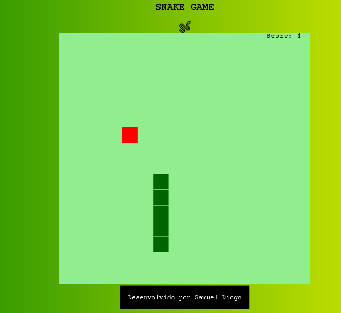
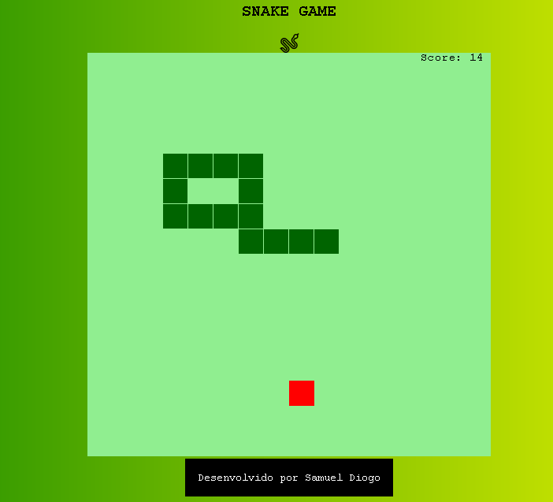

### Jogo-Cobrinha
Jogo da cobrinha feito com HTML,CSS e JAVASCRIPT. (Treinando os conhecimentos JAVASCRIPT).

#Alteraçoes
adição de um pontuaçao(score) no jogo e alteração no design da cobra.

<h1 align="center">
PROJETO SNAKE GAME!
</h1>

Digital Innovation one - Project for study purposes.

Click <a href="https://digitalinnovation.one/">here</a> To know the platform.

  

## Participants

[Sammynauta](https://github.com/Sammynauta)

## Resources

- [x] HTML, CSS, JAVASCRIPT.

## Start Dev Environment for VSCode

1. Open project folder in `VSCode`
2. Install `Live Server` and `Live Sass Compiler` extension
3. Right click `index.html` > `Open with Live Server`
4. Access the **generated address** in your browser 🚀